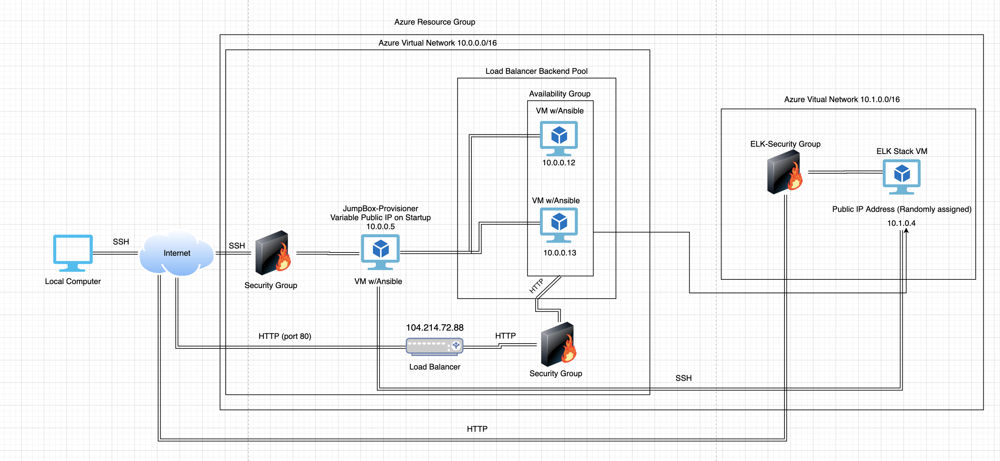

# CyberBootcamp_Project1
Week 13 - Azure Cloud Deployment Project

## Automated ELK Stack Deployment

The files in this repository were used to configure the network depicted below.

These files have been tested and used to generate a live ELK deployment on Azure. They can be used to either recreate the entire deployment pictured above. Alternatively, select portions of the _YAML_ file may be used to install only certain pieces of it, such as Filebeat.

  - [ELK Install YAML](Ansible_Playbooks/install-ELK.yml)

This document contains the following details:
- Description of the Topology
- Access Policies
- ELK Configuration
  - Beats in Use
  - Machines Being Monitored
- How to Use the Ansible Build

### Description of the Topology

The main purpose of this network is to expose a load-balanced and monitored instance of DVWA, the D*mn Vulnerable Web Application.

Load balancing ensures that the application will be highly __accessible___, in addition to restricting __too much traffic___ to the network.
- What aspect of security do load balancers protect? 
  - The load balancer protects the availability of the webservers 
- What is the advantage of a jump box?
  - The JumpBox is used to push changes to other machines listed in the *hosts* file via Docker. 

Integrating an ELK server allows users to easily monitor the vulnerable VMs for changes to the _metrics_ and system _logs_.
- What does Filebeat watch for?_
  - Filebeat tracks log data
- What does Metricbeat record?_
  - Metricbeat tracks machine usage data

The configuration details of each machine may be found below.
_Note: Use the [Markdown Table Generator](http://www.tablesgenerator.com/markdown_tables) to add/remove values from the table_.

| Name     | Function | IP Address | Operating System |
|----------|----------|------------|------------------|
| Jump Box | Gateway  | 10.0.0.1   | Linux            |
| Web - 1  | Webserver| 10.0.0.12  | Linux            |
| Web - 2  | Webserver| 10.0.0.13  | Linux            |
| ELK      | ELK-Stack| 10.1.0.4   | Linux            |

### Access Policies

The machines on the internal network are not exposed to the public Internet. 

Only the _Jumpbox_ machine can accept connections from the Internet. Access to this machine is only allowed from the following IP addresses:
- Add whitelisted IP addresses
  -  98.198.82.18

Machines within the network can only be accessed by _The JumpBox_.
- _Which machine did you allow to access your ELK VM? What was its IP address?_
  - My home computer. IP Address: 98.198.82.18

A summary of the access policies in place can be found in the table below.

_(Wasn't sure which set of "rules" were being requested. Included NSG rules and rules for each VM)_

| Name     | Publicly Accessible | Allowed IP Addresses |
|----------|---------------------|----------------------|
| Home_to_JumpBox | Yes          | (My home IP) 98.198.82.18 |
| JumpBox-SSH     | No           | 10.0.0.5 (Jumpbox) |
| Host_to_VNet    | No           | (My home IP) 98.198.82.18 |
| Jumpbox   | Yes     |  (My home IP) 98.198.82.18|
| Web -1 | No  | 10.0.0.5 (Jumpbox) |
| Web - 2 | No | 10.0.0.5 (Jumpbox) |
| ELK | Yes | (My home IP) 98.198.82.18 |

### Elk Configuration

Ansible was used to automate configuration of the ELK machine. No configuration was performed manually, which is advantageous because...
- _What is the main advantage of automating configuration with Ansible?_
  - This process is easily repeatable across multiple machines, if needed. It also makes the process of changing configuration settings as simple as setup.  

The playbook implements the following tasks:
- _In 3-5 bullets, explain the steps of the ELK installation play. E.g., install Docker; download image; etc._
  - Install Docker to ELK VM via Ubuntu repository
  - Install Python3 to VM
  - Install Docker module via Python repository
  - Increase virtual memory to 262144
  - Install seb/elk version 7.6.1 image to ELK docker container

The following screenshot displays the result of running `docker ps` after successfully configuring the ELK instance.

[ELK_Docker](Project_Images/ELK_Docker.png)

### Target Machines & Beats
This ELK server is configured to monitor the following machines:
- _TODO: List the IP addresses of the machines you are monitoring_
  - 10.0.0.12
  - 10.0.0.13 

We have installed the following Beats on these machines:
- _TODO: Specify which Beats you successfully installed_
  - Filebeat
  - Metricbeat

These Beats allow us to collect the following information from each machine:
- _TODO: In 1-2 sentences, explain what kind of data each beat collects, and provide 1 example of what you expect to see. E.g., `Winlogbeat` collects Windows logs, which we use to track user logon events, etc._
  - Filebeat collects information on all syslog data in real time for both Web - 1 and Web - 2 (webserver VMs). It will display all syslog event data
  - Metricbeat collects information about the Docker containers running on both Web - 1 and Web - 2 (webserver VMs). The type of information you should expect to find in Metricbeat is Docker containers per host (webserver) and the name/image data of those docker containers.

### Using the Playbook
In order to use the playbook, you will need to have an Ansible control node already configured. Assuming you have such a control node provisioned: 

SSH into the control node and follow the steps below:
- Copy the _configuration_ file to _Ansible_.
- Update the _configuration_ file to include _Kibana private IP_.
- Run the playbook, and navigate to _Kibana_ to check that the installation worked as expected.

_TODO: Answer the following questions to fill in the blanks:_
- _Which file is the playbook? Where do you copy it?_
  - [filebeat-playbook.yml](Ansible_Playbooks/filebeat-playbook.yml)
  - [metricbeat-playbook.yml](Ansible_Playbooks/metricbeat-playbook.yml)
  - Each of these playbook files were created and none of them are copied to any location. The configuration files were downloaded, and each of those were copied to the designated install locations: the webservers.
- _Which file do you update to make Ansible run the playbook on a specific machine? How do I specify which machine to install the ELK server on versus which to install Filebeat on?_
  - You have to update the [Ansible-hosts](Ansible_Playbooks/Ansible-hosts.txt) file to include the different private IP location categories: Webservers and ELK. You specify which grouping of IPs receives the YAML file changes by altering the "hosts" line at the top of the YAML file.
- _Which URL do you navigate to in order to check that the ELK server is running?
  - You will navigate to 'http://(ELK Public IP)/app/kibana to verify ELK is up and running.

_As a **Bonus**, provide the specific commands the user will need to run to download the playbook, update the files, etc._